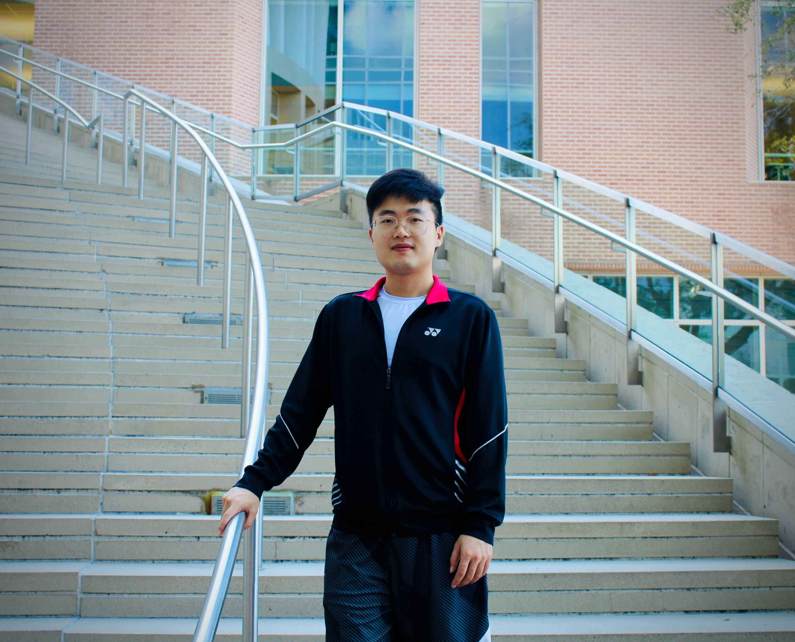

# Hello! Welcome to Yingchu Sun's Webiste!

# Academic Pages
**Academic Pages is a GitHub Pages template for personal and professional portfolio-oriented websites.**

# Description

Our team at Rice University is dedicated to pushing the boundaries of computer vision and optical engineering, developing cutting-edge tools to explore neural dynamics in unprecedented detail. As a Graduate Research Assistant for over four years in Dr. Lan Luan's lab, I have focused on building precise hardware and software systems that enable real-time analysis of neural and behavioral data. My journey spans key experiences at Zhejiang University and Boston University, where I honed technical skills that now support our interdisciplinary efforts at Rice.

## Thanks for the Academic Pages
 
This website is cloned from the Academic Pages (https://academicpages.github.io/). See more info at their website if you are interested. 

---

